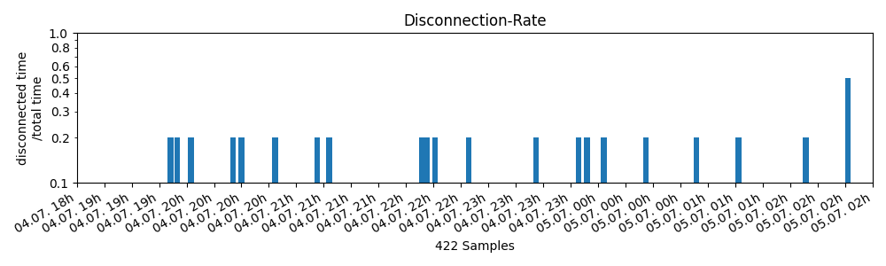

# ping-log
A very simple program to log ping-reply-times

# Get Started  
#### Installation  
You can download the repository as a zip and unpack it or just clone it with:
```
git clone https://github.com/ShaikaJar/ping-log.git
```  
Open the new folder with:
```
cd ping-log
```  

You then have to make the scripts executable with:

```
chmod u+x ./start.sh
chmod u+x ./start-show.sh
``` 

#### Logging
You can start a new [screen](https://help.ubuntu.com/community/Screen) that logs ping-results with:   
```
./start.sh
```

#### Plotting  
You can start a new [screen](https://help.ubuntu.com/community/Screen) that plots the content of the last 8 hours of data from the log-file with:
```
./start-show.sh
```
The plot will be served to **_http://\<device-address\>:8042_**  
If you run the script on the device you want to view it will be available on [localhost:8042](http://localhost:8042)

#### Example Result

